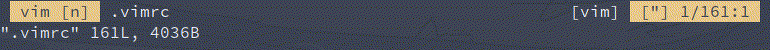

<div align="center">

# status.vim
pinosaur's lightweight vim status bar

</div>



`status.vim` is my own minimal status bar. I wrote it since I wanted a
functioning statusbar that doesn't slow down the rest of vim and doesn't have a
bunch of features I don't need.

Here are some things that `status.vim` does:
- Buffer modification indicator
- Indicator for current mode

# INSTALLATION

Using vim plug, you can install `status.vim` by adding the line in your plugin section:
```vimscript
Plug 'MrPicklePinosaur/status.vim
```

